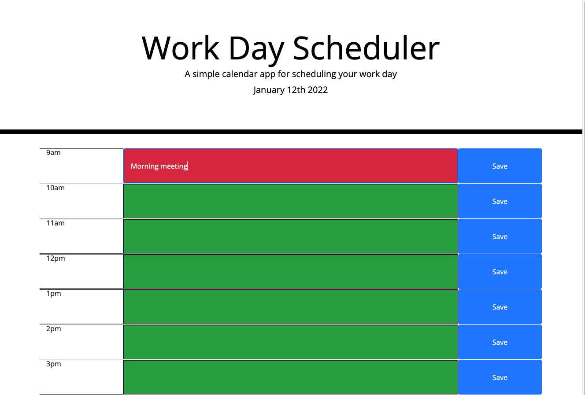

# Work Day Scheduler

Title: Work Day Scheduler

Developer: Francis Bond

Deployment Date: Jan 11, 2022

For: UT Coding Bootcamp

Published: GitHub 

Built with: HTML, CSS, Boostrap, Javascript & jQuery

## Summary

Page displays todays date and working hours timeblocks.

User can input their notes and save them to their timeblocks.

When the page is refreshed, saved notes stay on page.

## Development

This project was a great way for me to solidify concepts that we had previously. I had more that a few "aha" moments where concepts clicked.

Overcoming the bugs and getting clarity on concepts made this the most satisfying project to finish so far.

Deployed project [link](https://francis-bond.github.io/workdayscheduler/)